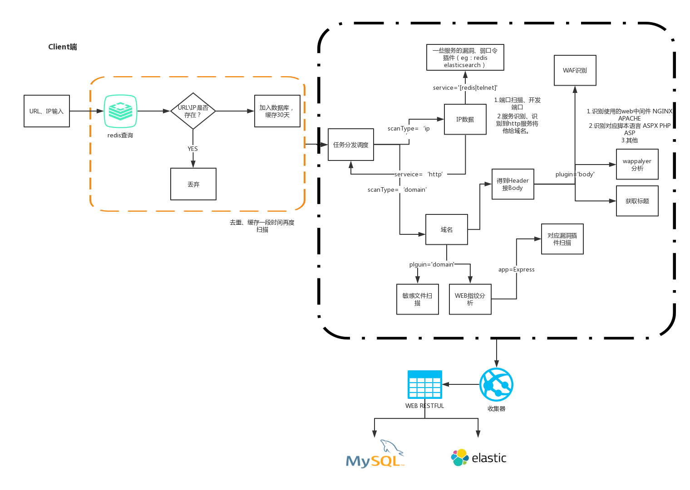

# w12scan_client
网络资产搜索发现引擎，毕业设计，w12scan 客户端程序

## 扫描器架构

## 插件规范
参见 [https://github.com/boy-hack/airbug](https://github.com/boy-hack/airbug)队列。

## Todo List
- [x] 插件调用采用线程方式在多线程中扫描
- [x] 插件的规范规则
- [ ] 完成WEB类插件
    - [x] BODY类
        - WAF识别
        - wappalyer分析
        - title
    - [x] 敏感文件扫描 
    - [ ] 优化备份文件扫描
    - WEB指纹分析
        - 可以远程调用AIRBUG https://github.com/boy-hack/airbug
    - [ ] bug漏洞添加log信息详情
    - [ ] 后台目录扫描(自动识别语言后扫描)
- [ ] 完成IP类插件