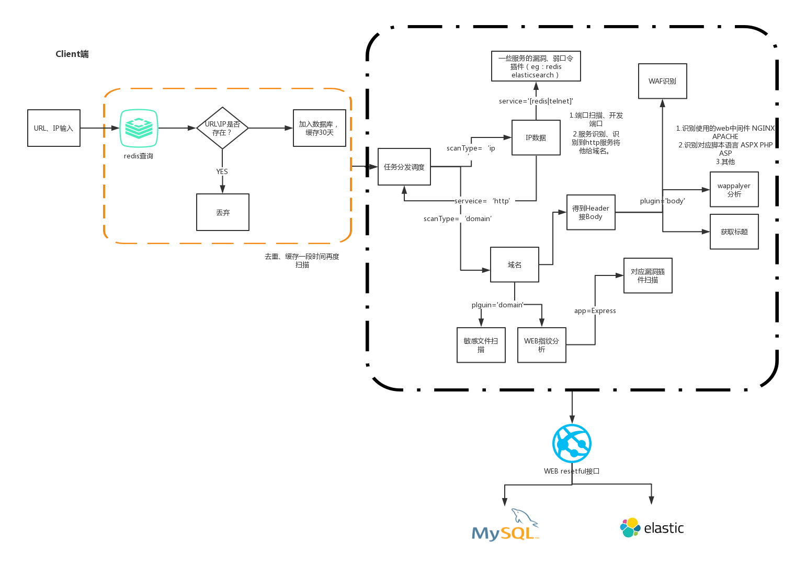

# w12scan_client
网络资产搜索发现引擎，毕业设计，w12scan 客户端程序

## 扫描器架构

## 插件规范

## Todo List
[x] 插件调用采用线程方式在多线程中扫描
[ ] 插件的规范规则
[ ] 完成WEB类插件
    - BODY类
        - WAF识别
        - wappalyer分析
        - title
    - 敏感文件扫描
    - WEB指纹分析
        - 可以远程调用AIRBUG https://github.com/boy-hack/airbug
    [ ] bug漏洞添加log信息详情
[ ] 完成IP类插件